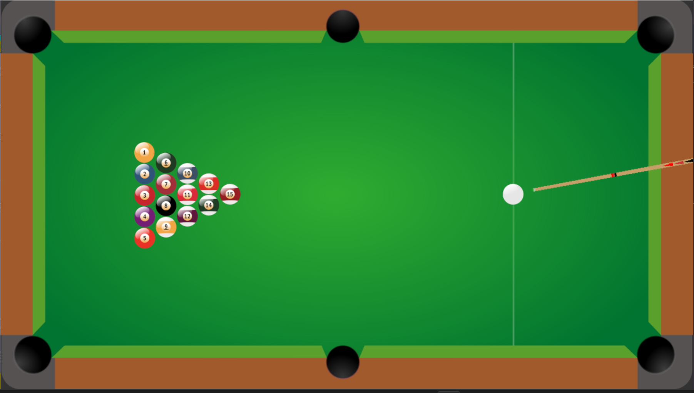
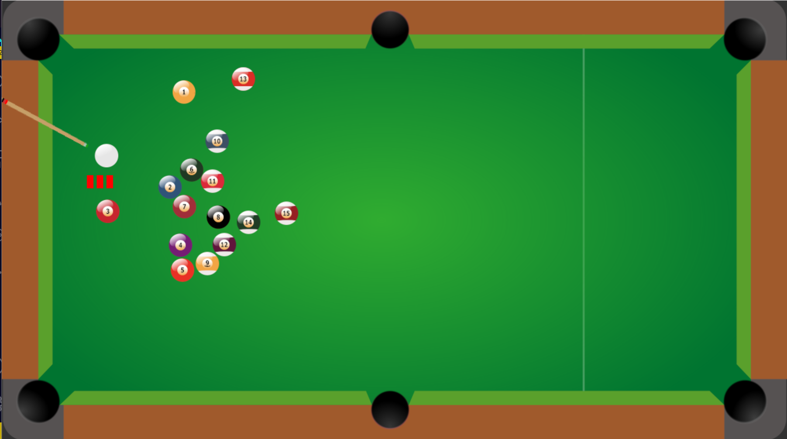

# 🎱 Pool Game

A simple **2D Pool Game** built using **Python**, **Pygame** for rendering, and **Pymunk** for realistic physics simulation.  
This project replicates the basic mechanics of a pool game with smooth ball movement, collision handling, and pocketing behavior.

---

## ✨ Features

- Realistic ball physics with friction and collision effects
- Smooth aiming and shooting mechanics
- Pocket detection when balls fall into the holes
- Simple and clean 2D graphics
- Scoring system (optional if implemented)

---

## 🛠️ Tech Stack

- **Language:** Python 3.x
- **Libraries:** 
  - [Pygame](https://www.pygame.org/news)
  - [Pymunk](http://www.pymunk.org/en/latest/)

---

## 🖼️ Screenshots

| Gameplay | Aiming |
| :---: | :---: |
|  |  |

---

## 🚀 Setup Instructions

### 1. Clone the repository

```bash
git clone https://github.com/AddyDev555/Pool-Game-CGVR
pip install pygame pymunk
python main.py
